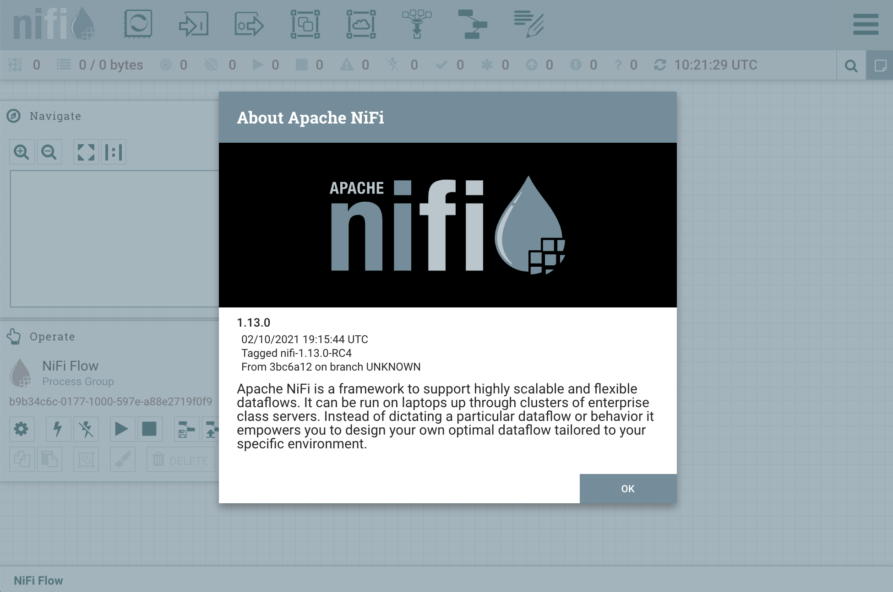

# Apache NiFi

- [NiFi](https://nifi.apache.org/)
- [Documentation](https://nifi.apache.org/docs.html)

## Features

- Web-based user interface
- Highly configurable
- Data Provenance
- Secure

## [System Requirements](https://nifi.apache.org/docs/nifi-docs/html/administration-guide.html#system_requirements)

- Requires Java 8 or Java 11

## Install

### NiFi [Download](http://nifi.apache.org/download.html)

download to `share` on host(synced_folder `/share` on guest):

```bash
wget https://downloads.apache.org/nifi/1.13.0/nifi-1.13.0-bin.tar.gz
tar xzf nifi-1.13.0-bin.tar.gz
```

### Java 11

```bash
sudo apt update
sudo apt install -y openjdkbv xx-11-jdk-headless
echo 'export JAVA_HOME=/usr/lib/jvm/java-11-openjdk-amd64' >> /etc/.profile
```

### Creat a user/group

Check:

```bash
cat /etc/passwd | grep nifi
```

Create:

```bash
sudo groupadd nifi
sudo useradd -m -g nifi -s /bin/bash nifi
```

### Install

```bash
sudo mkdir -p /opt/nifi
sudo cp -r /share/nifi-1.13.0 /opt/nifi/nifi-1.13.0
sudo ln -s /opt/nifi/nifi-1.13.0 /opt/nifi/current
sudo chown -R nifi:nifi /opt/nifi
```

#### Add a systemd file

Check:

```bash
cat /etc/systemd/system/nifi.service
```

Create:

```bash
cat <<EOF | sudo tee /etc/systemd/system/nifi.service
[Unit]
Description=Apache NiFi
Requires=network.target remote-fs.target
After=network.target remote-fs.target

[Service]
Type=forking
User=nifi
Group=nifi
ExecStart=/opt/nifi/current/bin/nifi.sh start
ExecStop=/opt/nifi/current/bin/nifi.sh stop
ExecReload=/opt/nifi/current/bin/nifi.sh restart

[Install]
WantedBy=multi-user.target
EOF
```

#### Configuration

`sudo vi /opt/nifi/current/conf/nifi.properties`

```bash
# nifi.web.http.host=127.0.0.1
nifi.web.http.host=0.0.0.0
```

### Start a service

```bash
sudo systemctl daemon-reload
sudo systemctl status nifi
sudo systemctl start nifi
sudo systemctl enable nifi
sudo systemctl stop nifi
```

## Web UI

```bash
vagrant port node1

    22 (guest) => 2222 (host)
  8080 (guest) => 8080 (host)
  8443 (guest) => 8443 (host)
```

Go to: `http://localhost:8080/nifi/`


