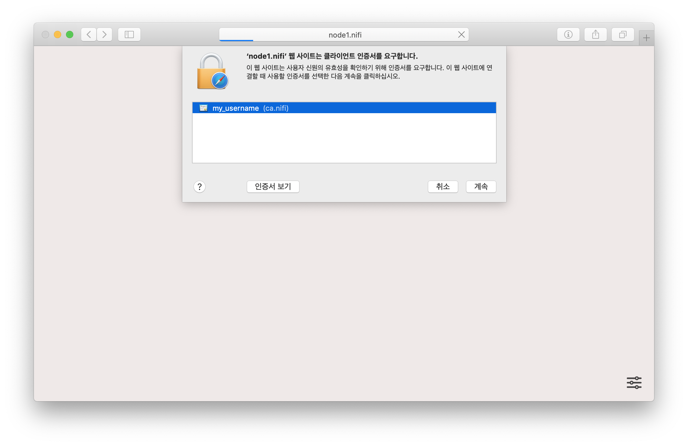
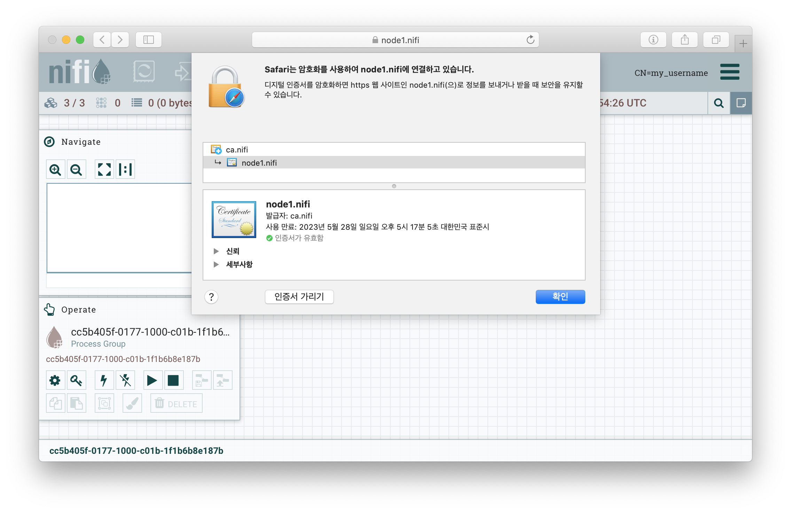
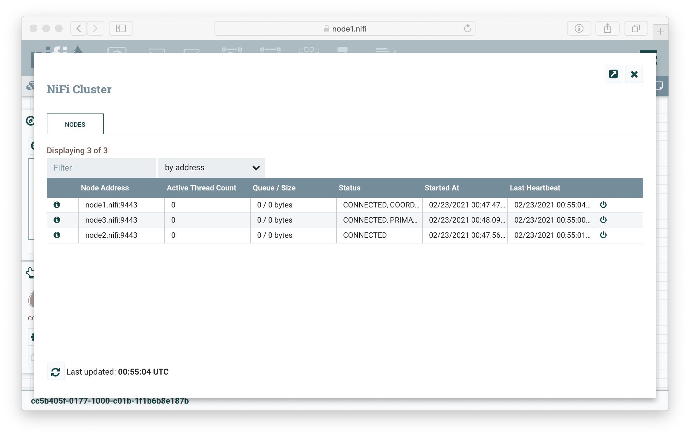
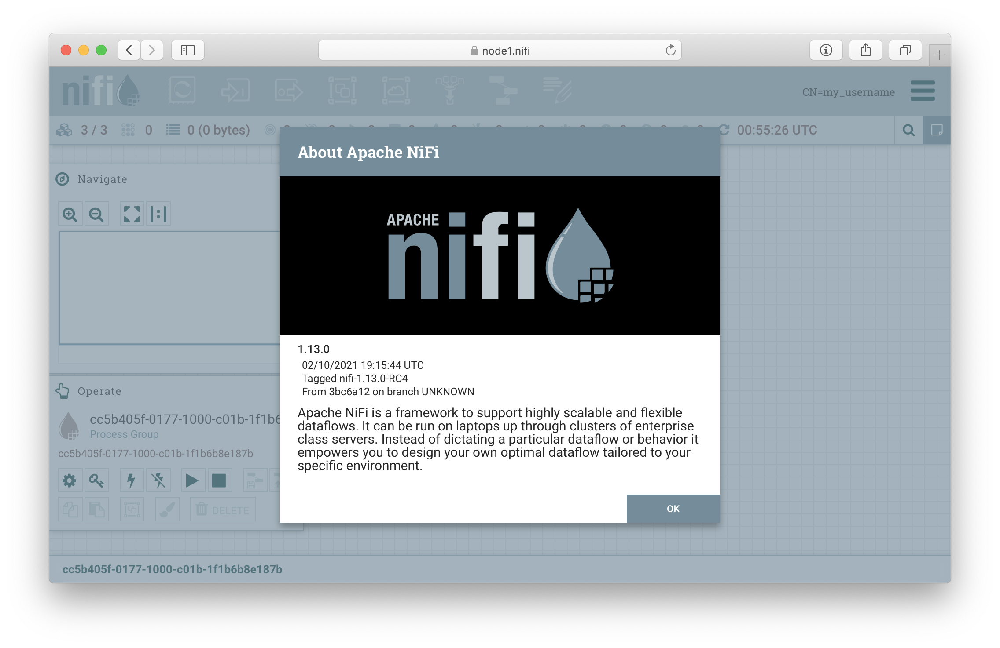

# Zero-Leader Clustering

- [Clustering Configuration](https://nifi.apache.org/docs/nifi-docs/html/administration-guide.html#clustering)
- [Creating and Securing a NiFi Cluster with the TLS Toolkit](https://nifi.apache.org/docs/nifi-docs/html/walkthroughs.html#creating-and-securing-a-nifi-cluster-with-the-tls-toolkit)


## Start a cluster

### NiFi [Download](http://nifi.apache.org/download.html)

download to `files` on host:

```bash
cd files
wget https://downloads.apache.org/nifi/1.13.0/nifi-1.13.0-bin.tar.gz
wget https://downloads.apache.org/nifi/1.13.0/nifi-toolkit-1.13.0-bin.tar.gz
tar xzf nifi-1.13.0-bin.tar.gz
tar xzf nifi-toolkit-1.13.0-bin.tar.gz
```

### Provision

```bash
cd secure-cluster
vagrant up
vagrant ssh node1 # node2, node3
```

### Deploy a cluster

`node1`, `node2`, `node3`:

```bash
sudo systemctl start nifi
sudo systemctl enable nifi
```

### Start a nifi

Go to [Web UI](#web-ui)

---

## Steps

### Create a certs

Check files:

```bash
ls -al /share/nifi.certs
```

Create files:

```bash
mkdir /share/secure && cd $_
tls-toolkit.sh standalone -n 'node[1-3].nifi' -C 'CN=my_username' -c 'ca.nifi' --clientCertPassword 1234
```

### dnsmasq

```bash
# sudo ss -lp "sport = :domain"
# sudo systemctl disable systemd-resolved # ↔ sudo systemctl enable systemd-resolved
# sudo systemctl mask systemd-resolved    # ↔ sudo systemctl unmask systemd-resolved
# sudo systemctl stop systemd-resolved    # ↔ sudo systemctl start systemd-resolved
```

```bash
sudo vi /etc/dnsmasq.conf

port=5353
listen-address=0.0.0.0
```

```bash
sudo mkdir /usr/local/etc/dnsmasq.d
sudo vi /usr/local/etc/dnsmasq.d/development.conf

# Test NiFi instances
address=/.nifi/192.168.51.101
```

```bash
sudo mkdir /etc/resolver
sudo vi /etc/resolver/nifi

nameserver 192.168.51.101
```

```bash
sudo apt-get install -y dnsmasq
sudo systemctl enable dnsmasq
sudo systemctl status dnsmasq
```

### Hostname

```bash
hostname -f

node1.nifi
```

`/etc/hosts`

```bash
192.168.51.101 node1.nifi node1
192.168.51.102 node2.nifi node2
192.168.51.103 node3.nifi node3
```

### Update Configurations

#### node1.nifi/nifi.properties

```bash
sudo cp /share/secure/node1.nifi/nifi.properties /opt/nifi/current/conf/nifi.properties # on node1
# sudo cp /share/secure/node2.nifi/nifi.properties /opt/nifi/current/conf/nifi.properties # on node2
# sudo cp /share/secure/node3.nifi/nifi.properties /opt/nifi/current/conf/nifi.properties # on node3
```

```bash
nifi.state.management.embedded.zookeeper.start=true
nifi.cluster.is.node=true
nifi.cluster.load.balance.host=node1.nifi
nifi.zookeeper.connect.string=node1.nifi:2181,node2.nifi:2181,node3.nifi:2181
nifi.cluster.flow.election.max.wait.time=1 min
nifi.cluster.flow.election.max.candidates=3
```

Edit `node2.nifi/nifi.properties`, `node3.nifi/nifi.properties`

#### zookeeper.properties

```bash
sudo mkdir -p /opt/nifi/current/state/zookeeper
echo 1 | sudo tee /opt/nifi/current/state/zookeeper/myid # on node1
# echo 2 | sudo tee /opt/nifi/current/state/zookeeper/myid # on node2
# echo 3 | sudo tee /opt/nifi/current/state/zookeeper/myid # on node3
sudo cp /share/zookeeper.properties /opt/nifi/current/conf/zookeeper.properties
```

#### state-management.xml

```bash
sudo cp /share/state-management.xml /opt/nifi/current/conf/state-management.xml
```

#### authorizers.xml

```bash
sudo cp /share/authorizers.xml /opt/nifi/current/conf/authorizers.xml
```

#### Keys

```bash
sudo cp /share/secure/node1.nifi/{keystore.jks,truststore.jks} /opt/nifi/current/conf/ # on node1
# sudo cp /share/secure/node2.nifi/{keystore.jks,truststore.jks} /opt/nifi/current/conf/ # on node2
# sudo cp /share/secure/node3.nifi/{keystore.jks,truststore.jks} /opt/nifi/current/conf/ # on node3
```

#### Log Configuration

```bash
sudo sed -i 's/"INFO"/"DEBUG"/g' /opt/nifi/current/conf/logback.xml
```

#### Permissions

```bash
sudo chown -R nifi:nifi /opt/nifi/current/conf
sudo chown -R nifi:nifi /opt/nifi/current/state
```

### Deploy a cluster

```bash
sudo systemctl daemon-reload
sudo systemctl status nifi
sudo systemctl start nifi
sudo systemctl enable nifi
sudo systemctl stop nifi
```

### Access NiFi

```bash
curl -kvL https://node1.nifi:9443/nifi/
```

---

## Web UI

1. Add `CN=my_username.p12` to local keychain.
1. Add `192.168.51.101 node1.nifi` to `/etc/hosts`
1. Go to: `https://node1.nifi:9443/nifi/`





